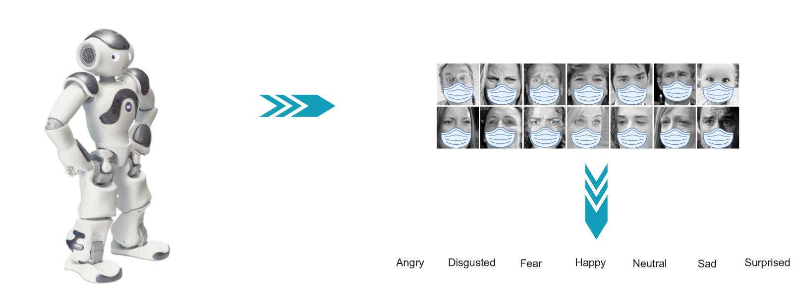
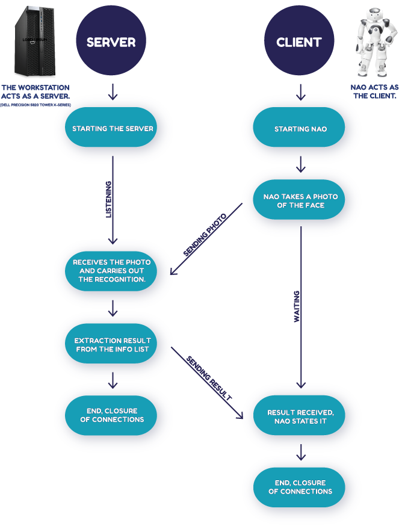

# Facial Expression Recognition (FER) of a face hidden by a mask, through the NAO robot
[](https://pypi.org/project/rmn)



## Introduction

This project aims to classify the emotion on a person's face, using the residual masking network, resulting in one of seven emotions: angry, disgusted, scared, happy, neutral, sad and surprised.
The model is trained on the “masked” FER-2013 dataset (modified with a tool that applied the mask on every single face). This dataset consists of 35887 grayscale face images, 48x48 in size, divided into seven folders for the seven types of emotions listed above.
The recognition is carried out by the NAO robot, it is supported by a Client-Server structure (where NAO acts as a client), created ad-hoc to mitigate the incompatibilities given by the different versions of Python (NAO still uses 2.7) and Python 3, as well as from the excessive computational load that NAO could not support.
Ultimately, NAO will take a photo, process it for a few seconds and then announce the outcome of the masked face recognition.

## Prerequisites for basic use
- First, clone the repository and enter the folder;
- Turn on NAO Robot using the Choregraphe software, which will connect it to the Wi-Fi network where it will be used: [Download Choregraphe](https://www.softbankrobotics.com/emea/en/support/nao-6/downloads-softwares)
- To get the recognition started, all you need is **Jupyter** and a development environment (such as **PyCharm**), or just familiarity with starting python files from **terminal**.
- To install Jupyter, here is the link: [Download Jupiter](https://jupyter.org/install)
- To install PyCharm, here is the link: [Download PyCharm free](https://www.jetbrains.com/pycharm/download/)
- **Python 3.6+**
- **Python 2.7**
- Python SDK for NAO robot: [Installation guide and download of pynaoqi](https://developer.softbankrobotics.com/nao6/naoqi-developer-guide/sdks/python-sdk/python-sdk-installation-guide)

### Starting the code

- Run **Server.ipynb**
```sh
Server.ipynb   # File for the Server part
```
- Next run **Nao_Client.py** (on PyCharm for example)
```sh
Nao_Client.ipynb   # File for the Client part of the NAO robot
```
- **Warning, this file runs on Python 2.7**! (NAO robot, only support this version)

## Use guide NAO
[Documents NAO multilanguage](https://www.softbankrobotics.com/emea/en/support/nao-6/downloads-documents)

## Client-Server operating diagram


## Neural network used
The neural network used is the [Residual Masking Network](https://github.com/phamquiluan/ResidualMaskingNetwork), trained differently, not with its FER2013 dataset, but using masked FER2013.
Approximately 63% accuracy was achieved.

## Dataset used for training
The dataset used for training, to generate the new model based on the recognition of the emotion of a masked face, is the FER2013 modified with a special tool that applies the medical masks to all the faces present.
Here is the tool repository: [face-mask](https://github.com/Prodesire/face-mask/blob/master/README.md)

### Example of Fer2013 masked version


## Authors
Raffaele Martone, University of Salerno (Italy), 2022.

## Citation
L. Pham, H. Vu, T. A. Tran, "Facial Expression Recognition Using Residual Masking Network", IEEE 25th International Conference on Pattern Recognition, 2020, 4513-4519. Milan - Italia.
